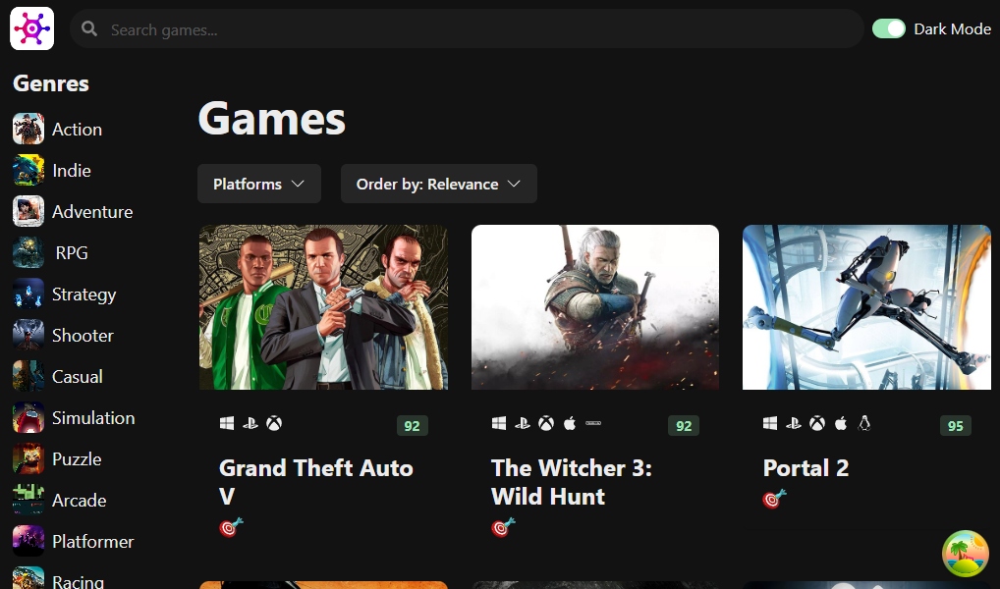

# Game Hub

This RAWG clone is a front end follow-along project coming from codewithmosh.com. It uses the Rawg API to for populating the UI with video game images, information, videos, etc. The user can search the database, filter by various criteria and navigate to a detail page for each game.

### Screenshot

